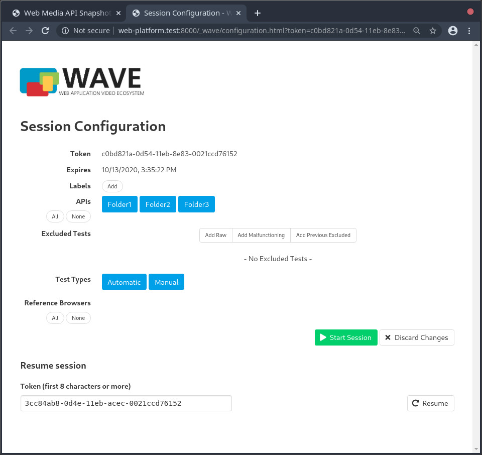
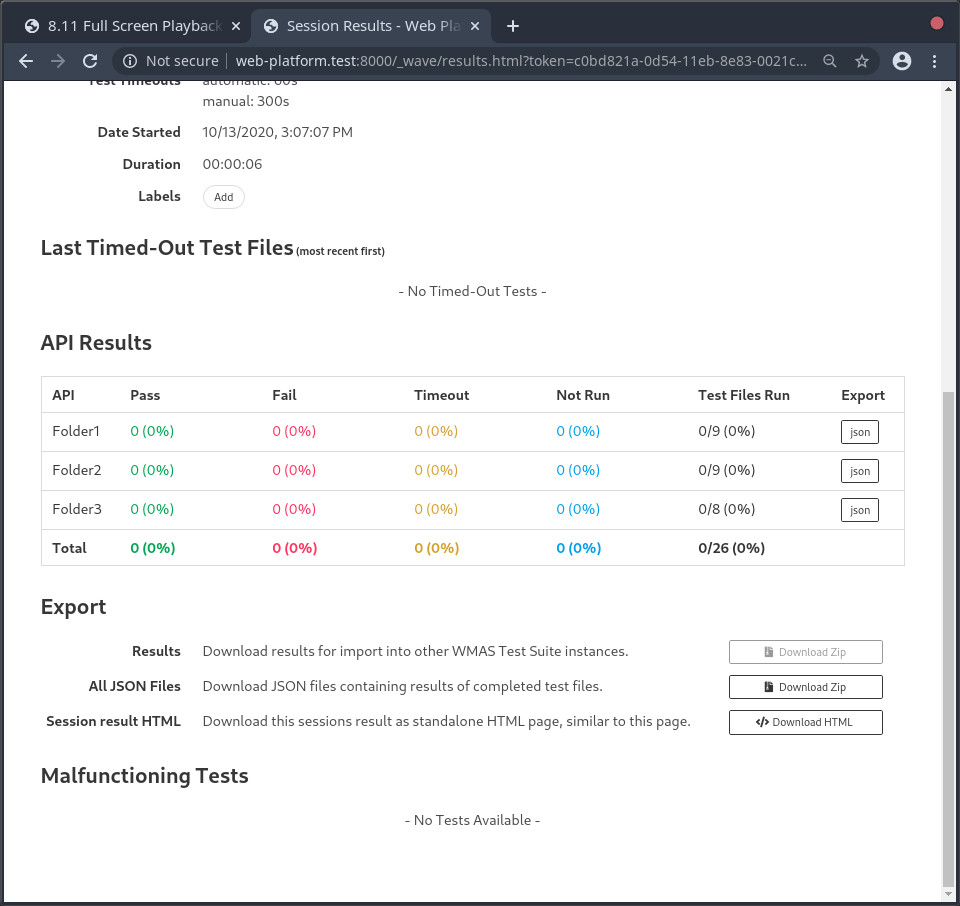

# DPCTF Tests

This repository contains tests for the [DPCTF Test
Runner](https://github.com/cta-wave/dpctf-test-runner).

## Generate Tests

To generate tests use the `generate-tests.py` script as follows

```
$ ./generate-tests.py <CSV-file> <destination-dir>
```

**CSV-file**: CSV file to generate tests from.  
**destination-dir**: Directory to put generated tests into.

As an example, in this repository the [`sample.csv`](./sample.csv) was used to generate tests inside the [`generated`](./generated) directory.

### CSV File Structure

Every row represents a generated test.

```csv
"<template-id>","<video-test-vector-url>","<audio-test-vector>","<group>"
```

**template-id**: What template to use.  
**video-test-vector-url**: URL to the video test content.  
**audio-test-vector-url**: URL to the audio test content.  
**group**: Name to group the generated test by. A directory per group is created.

Example

```csv
"fullscreen-playback-of-switching-sets-manual","http://host.net/video.mpd","http://host.net/audio.mpd","Folder1"
"out-of-order-loading-manual","http://host.net/video.mpd","http://host.net/audio.mpd","Folder2"
"overlapping-fragments-manual","http://host.net/video.mpd","http://host.net/audio.mpd","Folder1"
```

### Templates

| id                                                                         | file                                                                                                                                                                 | specification |
| -------------------------------------------------------------------------- | -------------------------------------------------------------------------------------------------------------------------------------------------------------------- | ------------- |
| sequential-track-playback-manual                                           | [sequential-track-playback-manual.html](./sequential-track-playback-manual.html)                                                                                     | 8.2           |
| random-access-to-fragment-manual                                           | [random-access-to-fragment-manual.html](./random-access-to-fragment-manual.html)                                                                                     | 8.3           |
| random-access-to-time-manual                                               | [random-access-to-time-manual.html](./random-access-to-time-manual.html)                                                                                             | 8.4           |
| switching-set-playback-manual                                              | [switching-set-playback-manual.html](./switching-set-playback-manual.html)                                                                                           | 8.5           |
| regular-playback-of-chunked-content-manual                                 | [regular-playback-of-chunked-content-manual.html](./regular-playback-of-chunked-content-manual.html)                                                                 | 8.6           |
| regular-playback-of-chunked-content-non-aligned-append-manual              | [regular-playback-of-chunked-content-non-aligned-append-manual.html](./regular-playback-of-chunked-content-non-aligned-append-manual.html)                           | 8.7           |
| playback-over-wave-baseline-splice-constraints-manual                      | [playback-over-wave-baseline-splice-constraints-manual.html](./playback-over-wave-baseline-splice-constraints-manual.html)                                           | 8.8           |
| out-of-order-loading-manual                                                | [out-of-order-loading-manual.html](./out-of-order-loading-manual.html)                                                                                               | 8.9           |
| overlapping-fragments-manual                                               | [overlapping-fragments-manual.html](./overlapping-fragments-manual.html)                                                                                             | 8.10          |
| fullscreen-playback-of-switching-sets-manual                               | [fullscreen-playback-of-switching-sets-manual.html](./fullscreen-playback-of-switching-sets-manual.html)                                                             | 8.11          |
| playback-of-encrypted-content-manual                                       | [playback-of-encrypted-content-manual.html](./playback-of-encrypted-content-manual.html)                                                                             | 8.12          |
| restricted-splicing-of-encrypted-content-manual                            | [restricted-splicing-of-encrypted-content-manual.html](./restricted-splicing-of-encrypted-content-manual.html)                                                       | 8.13          |
| sequential-playback-of-encrypted-and-non-encrypted-baseline-content-manual | [sequential-playback-of-encrypted-and-non-encrypted-baseline-content-manual.html](./sequential-playback-of-encrypted-and-non-encrypted-baseline-content-manual.html) | 8.14          |

Specification numbers refer to section numbers in [the DPCTF specification](https://cdn.cta.tech/cta/media/media/resources/standards/pdfs/cta-5003-final.pdf).

## Running Tests

To run the tests, you can run the test runner locally by following the
instructions in the [DPCTF Deployment
Repository](https://github.com/cta-wave/dpctf-deploy).

The test runner will group the tests according to the grouping used in the CSV file, which allows running them in subsets.


When configuring a session, individual test groups can be selected to be used in the session.


Test results will also be grouped accordingly.
