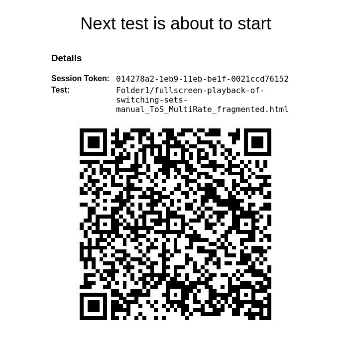
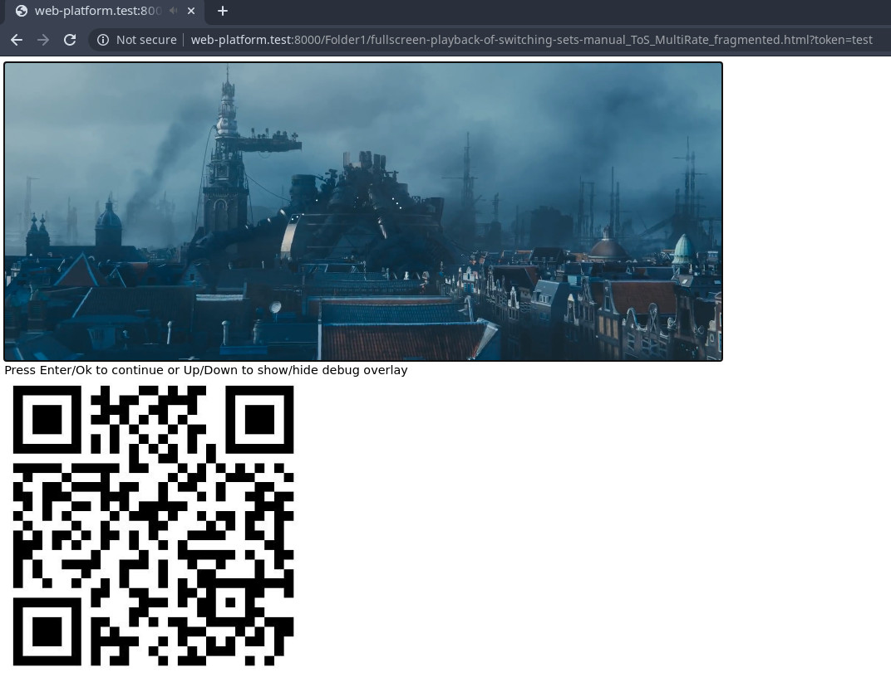

# Video Evaluation

## QR-Codes

### Pre-test

Additional QR-Codes provide information for an evaluation of video recordings. 
A pre-test control page announces the test that is about to be executed. It 
will contain human readble text, as well as a QR-code with information about 
the upcoming test.



The QR-Code contains the following data structure:

```json
{
  "session_token": "014278a2-1eb9-11eb-be1f-0021ccd76152",
  "test_url": "Folder1/fullscreen-playback-of-switching-sets-manual_ToS_MultiRate_fragmented.html"
}
```

- **session_token**: The token of the current session  
- **test_url**: The URL to the upcoming test

The duration of pre-test control page can be configured in the test runners 
`config.json` file.

### Test embedded

Another QR-Code will be embedded into the test page itself. It contains 
information about the last action the test harness performed, as well as the 
current state of the video element.



The QR-Code contains the following data structure:

```json
{
  "state": "playing",
  "action": "play"
}
```

- **state**: The current state of the video element. Can be any of the following:
  - `waiting`
  - `buffering`
  - `playing`
  - `paused`
  - `ended`
- **action**: The last action the test harness performed. Can be any of the following:
  - `initialize`
  - `play`
  - `pause`

## Test Results

The information provided by the pre-test control page may be used to integrate 
the test results of the observation framework into the test results generated 
by the test runner.

Using the _session token_, test results may be downloaded after the session has finished:

```
GET /api/results/<session_token>/json
```

Additional information can be found [here](https://github.com/cta-wave/dpctf-test-runner/blob/master/tools/wave/docs/rest-api/results-api/download.md#3-download-all-apis)

Using the _test url_, the test results created by the evaluation of the 
recorded video may be inserted into the downloaded json file accordingly. To 
integrate the results back into the session, it may be uploaded using the 
_session token_:

```
POST /api/results/<session_token>/json
```

Note: The API to upload test results into a session is not yet implemented.
